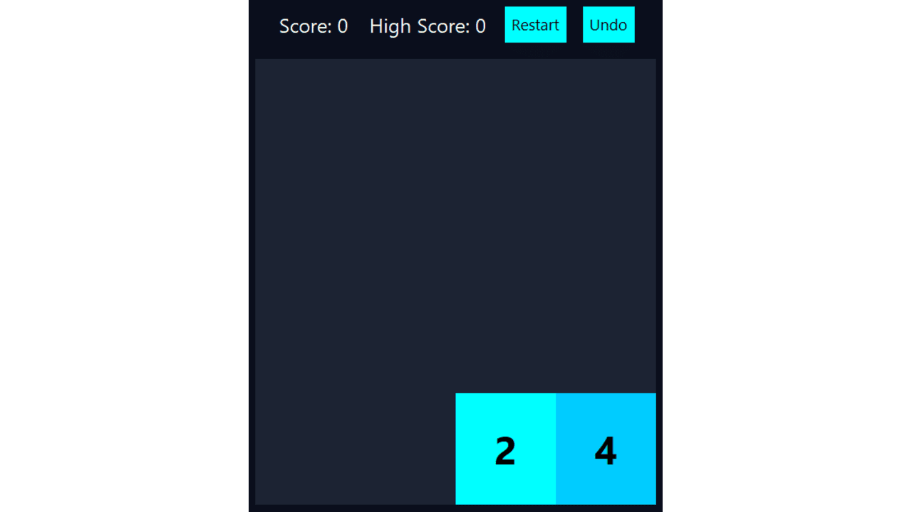
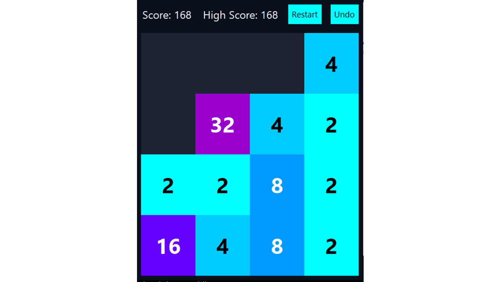
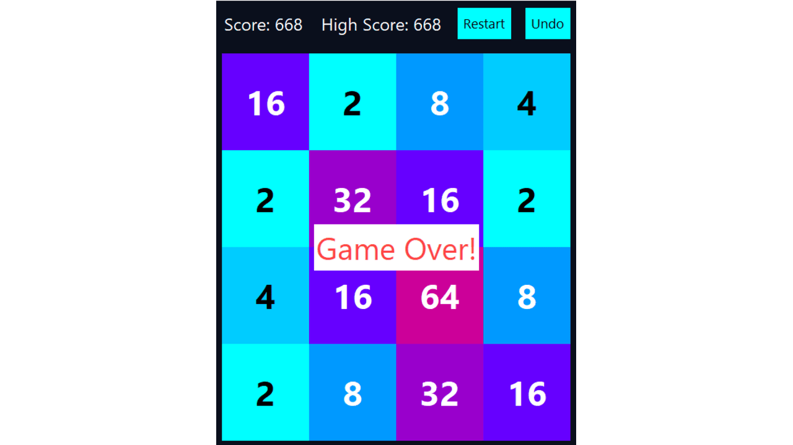
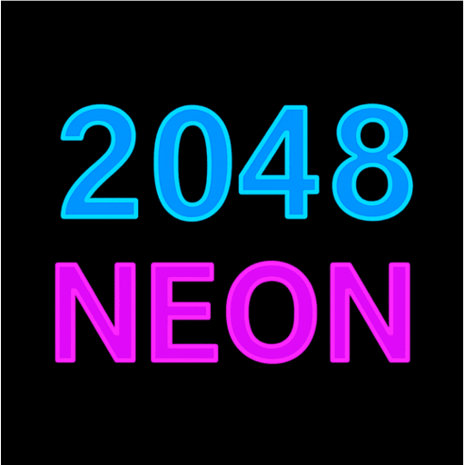

# 2048 Neon

A neon-themed version of the classic 2048 puzzle game, built in Python with a standalone `.exe`.

## 🎮 Features
- 4×4 grid gameplay
- Neon glow UI with undo and restart buttons
- Offline play, lightweight executable
- No installation required

## 📦 How to Play
1. Download `2048_neon.exe` from the repository
2. Run the game — no setup needed
3. Use arrow keys to merge tiles and reach 2048

## 🖼️ Screenshots
  
  

## 🎨 Logo

## 🔒 License

This project is licensed under the MIT License. You are free to use, modify, and distribute this game with proper attribution.
